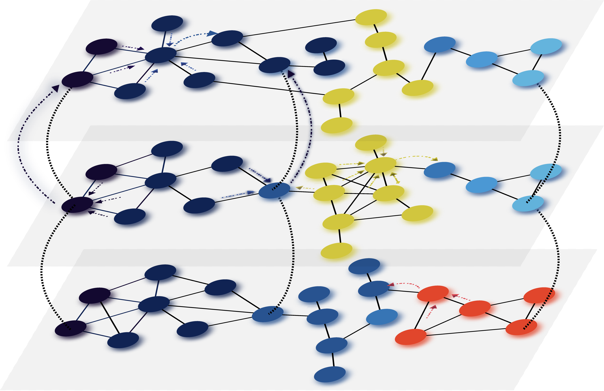

Multilayer Modularity Belief Propagation (modbp)
=================================================================
A belief propagation solution to multilay modularity community detection.

We have implemented a belief propagation solution for multilayer modularity in both \
C++ and Python.  Our implementation allows for both weighted and unweighted single layer networks\
as well as a variety of multilayer topologies.  The C++ backend provides significant performance increase\
and allows for running the algorithm at larger scale networks.  Our method extends the approach of \
 `Pan Zhang and Christopher Moore <https://https://arxiv.org/abs/1403.5787>`_ and provides a convenient interface with \
the standard networks analysis library, igraph.

Download and Installation:
____________________________

The *modbp* module is hosted on `PyPi <https://pypi.python.org/pypi/modbp>`_.  The easiest way to install is \
via the pip command::

   pip install modbp

For installation from source, the latest version of modbp can be downloaded from GitHub\:

   `Multimodbp Github <https://github.com/bwalker1/ModularityBP_Cpp>`_

For basic installation:

.. code-block:: bash

   python setup.py install

Dependencies
***************

To make our code run as quickly as possible, the underlying belief propagation algorithm has been written in C++.  Wrapping and interfacing this code with the Python tools requires `swig <http://www.swig.org/index.php>`_, a tool for creating Python classes from C++ objects.

The python dependencies for *modbp* are fairly standard tools for data analysis in Python:

+ `NumPy <https://www.scipy.org/scipylib/download.html>`_ \: Python numerical analysis library.
+ `sklearn <http://scikit-learn.org/stable/install.html>`_ \:Machine learning tools for python.
+ `python-igraph <http://igraph.org/python/#downloads>`_ \:igraph python version for manipulation of networks.
+ `matplotlib <https://matplotlib.org/users/installing.html>`_ \:Python data visualization library.
+ `pandas  <https://pandas.pydata.org/pandas-docs/stable/install.html>`_ \:data structures and data analysis tools for python.

These should all be handled automatically if using pip to install.

We are also working on creating a conda recipe for easy installation through conda forge.

Citation
___________

For more details and results see our `manuscript <https://arxiv.org/abs/1908.04653>`_

Acknowledgements
_________________

